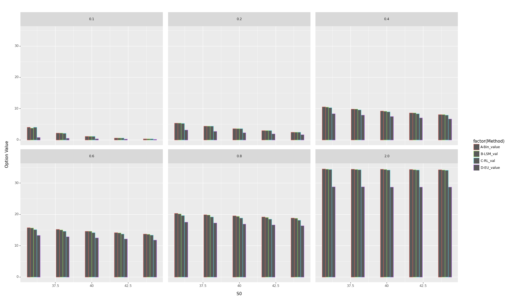

# Option Pricing: An Empirical Evaluation of Binomial, Reinforcement Learning, and Least Squares Monte Carlo Approaches

## Abstract

[Write a brief summary of your paper's main objectives and findings.]

## 1. Introduction

[Provide an introduction to your paper, explaining the background and context of the research.]

## 2. Literature Review

[Discuss relevant literature and previous work related to your research topic.]

## 3. Methodology

### Binomial Options Pricing Model 

The original Bin was developed to price option on underlying whose price evolves according 
to a lognormal stochastic process, where the stochastic process is in the form of discrete-time, finite-horizon, finite states.

- $$dS_t = r.S_t.dt + \sigma.S_t.dz_t$$

$\sigma$ is the lognormal dispersion (volatility), $r$ lognormal drift

- What is Bin : serves as a discrete-time, finite-horizon, finite-states approximation to the continous proocess.

- We denote $S_{i,j}$ as the price after $i$ time steps in state $j$ (for any $i$ \in Z>0 and for any $0<j<i$), 

- We need to calibrate $S_{i+1,j+1}=S_{i,j}.u$ and $S_{i+1,j}=S_{i,j}.d$

<!--- Variance Calibration
$$log^²(u) = \frac{\sigma^2T}{n} \Rightarrow u = e^{\sigma \sqrt{\frac{T}{n}}}$$
- Mean Calibration

<!-- - $$qu + \frac{1-q}{u} = e^{\frac{rT}{n}} \Rightarrow q = \frac{u.e^{\frac{rT}{n}-}-1}{u^2-1}=\frac{e^{\frac{rT}{n}+\sigma\sqrt{\frac{T}{n}}}-1}{e^{2\sigma\sqrt{{\frac{T}{n}}}}-1}$$-->

% Variance Calibration
$$\log^2(u) = \frac{\sigma^2T}{n} \Rightarrow u = e^{\sigma \sqrt{\frac{T}{n}}}$$

% Mean Calibration
% $$qu + \frac{1-q}{u} = e^{\frac{rT}{n}} \Rightarrow q = \frac{u.e^{\frac{rT}{n}}-1}{u^2-1}=\frac{e^{\frac{rT}{n}+\sigma\sqrt{\frac{T}{n}}}-1}{e^{2\sigma\sqrt{{\frac{T}{n}}}}-1}$$

- The calibration for $u$ and $q$ ensures that as $n \rightarrow \infty$ (i.e., time step interval $\frac{T}{n} \rightarrow 0$), the mean and variance of binomial distributaion after i time steps matches the mean $(r-\frac{\sigma^2}{2})\frac{iT}{n}$ and variance $\frac{\sigma^2iT}{n}$ 

#### Procedure
  
As mentioned earlier, we want to model the problem of Optimal Exercise of American Options as a discrete-time, finite-horizon, finite-states MDP. We set the terminal time to be $t = T + 1$, meaning all the states at time $T + 1$ are terminal states. Here we will utilize the states and state transitions (probabilistic price movements of the underlying) given by the Binomial Options Pricing Model as the states and state transitions in the MDP. The MDP actions in each state will be binary—either exercise the option (and immediately move to a terminal state) or don’t exercise the option (i.e., continue on to the next time step’s random state, as given by the Binomial Options Pricing Model). If the exercise action is chosen, the MDP reward is the option payoff. If the continue action is chosen, the reward is $0$. The discount factor $\lambda$ is $e^{-\frac{rT}{n}}$ since (as we’ve learnt in the single-period case), the price (which translates here to the Optimal Value Function) is defined as the riskless ratediscounted expectation (under the risk-neutral probability measure) of the option payoff. In the multi-period setting, the overall discounting amounts to composition (multiplication) of each time step’s discounting (which is equal to $\lambda$) and the overall risk-neutral probability measure amounts to the composition of each time step’s risk-neutral probability measure (which is specified by the calibrated value $q$).

### Reinforcement Learning 

#### MDP model for American Option Pricing 

- **State** is [Current Time, Relevant History of Underlying Security Prices]
- **Action** is Boolean: Exercise(i.e, Stop) or Continue
- **Reward** is always 0, except upon Exercise (When the Reward is euqal to the Payoff)
- State-transitions are based on the Underlying Securities Risk-Neutral Process.

$$
Q(s,a; \mathbf{w})=\begin{cases}
    \phi(s)^T.\mathbf{w},& \text{if  } a=c  \\ 
    g(s)              & \text{if  } a=e
\end{cases}
$$

Feature functions $\phi(.)= [\phi(.)|i=1,\cdots, m]$

\textbf{LSPI Semi-Gradient Equation}

$$\sum_i\phi(s_i).(\phi(s_i)^T. \mathbf{w}^*-\gamma.Q(s_i^{\prime}, \pi_D(s_i^{\prime});\mathbf{w}^*)$$

- $$Q(s_i^{\prime}, \pi_D(s_i^{\prime});\mathbf{w}^*)$$

- $C1$: if $s_i^{\prime}$ is non-terminal and $\pi_D(s^{\prime}) = c(i.e, \phi(s_i^{\prime}).\mathbf{w}>g(s_i^{\prime}))$ substitute $\phi(s_i^{\prime})^T. \mathbf{w}^*$

- $C2$: if $s_i^{\prime}$ is a terminal state or $\pi_{D}(s_{i}^{\prime})=e$ (i.e, 
$g(s_i^{\prime})>\phi(s_i^{\prime}).\mathbf{w})$: Substitute $g(s_i^{\prime})$

$$\sum_i\phi(s_i).(\phi(s_i)^T.\mathbf{w}^*- I_{C1}.\gamma.\phi(s_i^{\prime})^T.\mathbf{w}^*-I_{C2}.\gamma.g(s_{i}^{\prime}))$$

Factoring out $\mathbf{w}^{*}$ we get:
$$\sum_i\phi(s_i).(\phi(s_i)- I_{C1}.\gamma.\phi(s_i^{\prime})^T).\mathbf{w}^*=\sum_{i} I_{C2}.\phi(s_i).g(s_{i}^{\prime}))$$

This can be written in 
$$\mathbf{A}.\mathbf{w}^*=b$$

- $$\mathbf{A}=\sum_i\phi(s_i).(\phi(s_i)- I_{C1}.\gamma.\phi(s_i^{\prime})^T)$$
- $$\mathbf{b}=\sum_{i} I_{C2}.\phi(s_i).g(s_{i}^{\prime}))$$

The $m\times m$ Matrix $\mathbf{A}$ is accumulated at each atomic experince $(s_i, s_i^{\prime})$:

- $$\mathbf{A} \Leftarrow \mathbf{A} + \phi(s_i).(\phi(s_i)- I_{C1}.\gamma.\phi(s_i^{\prime})^T)$$

- $$\mathbf{b} \Leftarrow \mathbf{b} + \gamma I_{C2}.\phi(s_i).g(s_{i}^{\prime})$$

This solved $w^{*}$ updates Q-valueFunction Approximation $Q(s,a; \mathbf{w}^*)$. This defines an updated , imrpoved deterministic policy $\pi_{D}^{\prime}$ :

$$\pi_{D}^{\prime}(s) = \operatorname*{arg max }_{a} Q(s,a; \mathbf{w}^*)$$

Using 7 feature functions, the first 4 Laguerre polyomials that are function of underlying price and 3 functions of time. 

- $\phi(S_t) = 1$
- $\phi(S_t) = e^{-\frac{M_t}{2}}$
- $\phi(S_t) = e^{-\frac{M_t}{2}}.(1-M_t)$
- $\phi(S_t) = e^{-\frac{M_t}{2}}.(1-2M_t+M_t^2/2)$
- $\phi(S_t) = sin(\frac{\pi(T-t)}{2T})$
- $\phi(S_t) = log(T-t)$
- $\phi(S_t) = (\frac{t}{T})^2$

### LSM model

#### The Pricing is based on set of sampling traces of the underlying prices

### Function approximation of the continuation value for in-the-money states

The LSM approach uses least squares to approximate the conditional expectaion function at $t_{K-1}, t_{K-2}, \cdots, t_1$:

- Unknown functional form:

$$F(\omega; t_{K-1})$$

- The unknown functional form can be represented as:

$$F(\omega; t_{K-1})=\sum_{j=0}^{\infty}a_jL_j(X)$$

In this work choice of basis function is set of Lageurre polynomials:

$$L_1(X)=1$$
$$L_2(X)= 1-X$$    
$$L_3(X) = 1 - 2X + X^2/2$$
$$L_4(X) = 1 - 3X + 3X^2/2 - X^3/6$$ 
$$L_5(X) = 1 - 4X + 3X^2 - 2X^3/3 + X^4/24$$

- In the python code unknown function can be represented as:

$$F(\omega; t_{K-1})=\sum_{j=0}^{5}a_jL_j(X)$$

In this work we focus only in-the-money paths in the estimation since the exercise decision is only relevant when the option is in the money.

### Backward -recursive determination of early exercise states

[Explain the methods and techniques you used to conduct your research.]
## 4. Price Models

\section*{\textbf{Price Models}\label{price_models}}

\textbf{Geometric Brownian Motion}

Consider a stochastic process $x$ described in the form of the following **Ito** process:

$$dx_t = \mu(t).x_t.d_t + \sigma(t).x_t.dz_t$$

The special case of $\mu(t)=\mu (constant)$ and $\sigma(t) = \sigma(constant)$ known as **Geomstric Brownian Motion**, to reflect the fact that the stochastic increment of the process $(\sigma.x_t.dz_t)$ is multiplicative to the level of the process $x_t$. If we cosnider this special case, we get:

$$y_T = log(x_T) \sim \mathcal{N}(log(x_S) + (\mu-\frac{\sigma^2}{2})(T-S), \sigma^2(T-S))$$

$$E[x_T|x_S]=x_S.e^{\mu(T-S)}$$
$$Variance[x_T|x_S]=x_S^2.e^{2\mu(T-S)}.(e^{\sigma^2(T-S)}-1)$$

#### Generalized Autoregressive Conditional Heteroskedasticity (GARCH) process is defined as 

$$r_t = \mu_t + \epsilon_t$$

where $r_t$ is..., where $\mu_t$ can be any adapted model for the conditional mean. $\epsilon_t$ can be defined as :

$$\sigma_t^2 = \omega + \sum_{p=1}^{P}\alpha_p\epsilon_{t-p}^{2} + \sum_{q=1}^{Q}\beta_q\sigma_{t-q}^{2}$$

$$\epsilon_t = \sigma_te_t$$

$$e_t \sim N(0,1)$$

A simple GARCH (1,1) can be defined as:

A simple GARCH(1,1) can be defined as:
$$r_t= \mu_t + \epsilon_t$$
$$\sigma_t = \omega + \alpha_1\epsilon_{t-1}^2 + \beta\sigma_{t-1}^2$$
$$\epsilon_t = \sigma_t e_t$$

$$e_t \sim N(0,1)$$

#### Maximum Likelihood

Since the errors are assumed to be conditionally i.i.d normal, maximum likelihood is a natural choice to estimate the unknown parameters, $\theta$ which contain both the mean and variance parameters. The normal likelihood for $T$ independent variables is:

$$f(r;\theta) = (2\pi\sigma_t^{2})^{-1/2}exp(-\frac{-(r_t-\mu_t)}{2\sigma_t^2})$$

And the normal log-likelihood function is:

$$l(\mathbf{r};\theta)= \sum_{t=1}^{T}\log(f(r;\theta)) = \sum_{t=1}^{T}-\frac{1}{2}\log(2\pi)-\frac{1}{2}\log(\sigma_t^2)-\frac{(r_t-\mu)}{2\sigma_{t}^2}$$

## 5. Results

[Present the findings and results of your research.]

### A) Bin, RL and LSM Option Valuation 

#### Part I) Example of Geometric Brownian Motion (GBM) - Constant Volatility Value Model

|   $S$ |   $\sigma$ |   $T$ |   Closed form European |   Binomial Tree |   LSM |  RL |
|-----:|------:|----:|-------------:|--------------:|------------:|-----------:|
|   36 |   0.2 |   1 |        3.844 |         4.488 |       4.472 |      4.42  |
|   36 |   0.2 |   2 |        3.763 |         4.846 |       4.837 |      4.772 |
|   36 |   0.4 |   1 |        6.711 |         7.119 |       7.108 |      6.954 |
|   36 |   0.4 |   2 |        7.7   |         8.508 |       8.514 |      8.298 |
|   38 |   0.2 |   1 |        2.852 |         3.26  |       3.255 |      3.197 |
|   38 |   0.2 |   2 |        2.991 |         3.748 |       3.741 |      3.669 |
|   38 |   0.4 |   1 |        5.834 |         6.165 |       6.131 |      5.987 |
|   38 |   0.4 |   2 |        6.979 |         7.689 |       7.669 |      7.472 |
|   40 |   0.2 |   1 |        2.066 |         2.316 |       2.309 |      2.247 |
|   40 |   0.2 |   2 |        2.356 |         2.885 |       2.906 |      2.814 |
|   40 |   0.4 |   1 |        5.06  |         5.31  |       5.316 |      5.151 |
|   40 |   0.4 |   2 |        6.326 |         6.914 |       6.89  |      6.724 |
|   42 |   0.2 |   1 |        1.465 |         1.622 |       1.624 |      1.598 |
|   42 |   0.2 |   2 |        1.841 |         2.217 |       2.221 |      2.156 |
|   42 |   0.4 |   1 |        4.379 |         4.602 |       4.593 |      4.447 |
|   42 |   0.4 |   2 |        5.736 |         6.264 |       6.236 |      6.055 |
|   44 |   0.2 |   1 |        1.017 |         1.117 |       1.114 |      1.071 |
|   44 |   0.2 |   2 |        1.429 |         1.697 |       1.694 |      1.665 |
|   44 |   0.4 |   1 |        3.783 |         3.956 |       3.975 |      3.86  |
|   44 |   0.4 |   2 |        5.202 |         5.652 |       5.658 |      5.429 |

#### Part II) Example of GARCH (1,1) -Stochastic Volatility Value Model

### Analyzing the distribution of option value

XXX

### Exploring decision boundaries

XXX

### Examining policy differences under varying volatilities.

{width=700px height=600px}

### Discussing the distinctions between RL and the standard Bellman equation

## 5. Discussion

[Interpret the results and provide a discussion about their implications.]

## 6. Conclusion

[Summarize the key points of your paper and draw conclusions.]

## 7. References

[List all the references cited in your paper using APA or MLA citation style.]
